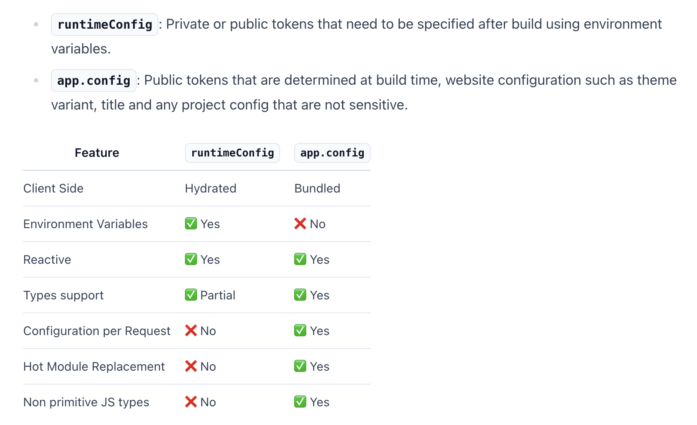

> yarn add -D vuetify vite-plugin-vuetify

> yarn add @mdi/font

https://www.codybontecou.com/how-to-use-vuetify-with-nuxt-3.html

# Cypress (Unit testing)

https://www.codybontecou.com/lets-setup-nuxt-3-with-cypress.html

> yarn add cypress

> npx cypress open

https://www.youtube.com/watch?v=cnnkb0AuIFI&list=PLUDwpEzHYYLvA7QFkC1C0y0pDPqYS56iU&index=2

# Write the basic test case

> yarn cypress:run --spec cypress/e2e/MyFirstTest.cy.js

# Locators

- CSS selector
  - tag id (tag.#id)
  - tag class tag.class
  - tag attribute tag.([attribute='value']) (ex: input[name="dustin"])
  - tag class attribute tag.class[[attribute='value']]
- Xpath
  > yarn add cypress-xpath

cy.get(Locator)

# Cypress Assertions

1. Implicit assertions

- should
- and
- include
- exist
- have.length
- have.value

etc...

2. Explicit assertions

- expect - BDD: Behavior Driven Development
- assert - TDD: Test Driven Development

3. Folder structure

4. Interacting with Element

- Radio Button and Checkboxes

5. Dropdown

# Cypress Component (config)

https://www.codybontecou.com/cypress-component-testing-with-nuxt-3.html

# prettier

https://viblo.asia/p/cai-dat-eslint-prettier-cho-nuxt-3-Yym40ZjjL91

# Graphql

https://viblo.asia/p/su-dung-graphql-trong-du-an-nuxt-p1-aWj53n2ol6m

# Example test

https://www.cypress.io/blog/2017/11/28/testing-vue-web-application-with-vuex-data-store-and-rest-backend

# Doc

https://nuxt.com/docs/getting-started/error-handling

# Husky

https://typicode.github.io/husky/get-started.html

# References:

https://www.numpyninja.com/post/cypress-part-2-css-xpath-locators-assertions-folder-structure-interacting-with-webelements
